# VirtualBox

**VirtualBox**  - это виртуальная машина (ВМ) под Windows. 

### Установка программы
1. Для начала, скачайте `exe` файл VirualBox с [официального сайта](https://download.virtualbox.org/virtualbox/7.2.20/VirtualBox-7.2.20-175154-Win.exe)
2. Откройте установщик и произведите базовую установку. Для удобства можете поменять расположение самой программы (не обязательно)
3. Перед началом настройки, также скачайте [.iso образ Windows 10](https://software.download.prss.microsoft.com/dbazure/Win10_22H2_English_x64v1.iso?t=724876f3-55fc-448c-8186-de1ae3bd4d7a&P1=1790245997&P2=602&P3=2&P4=hZonCHEIEeImqtF0glMOiQtboM5lK9CACqwL2BvJPx0M1YrVpE4%2FVbgOKARezgT0Js92DJHZm2tE5snv2SBbDeEzca%2F9bJozTOkhex2AMdE%2FLRvYUoBPy9AGc%2FtMWZSP3CCdhoz7dpdtoT9oRkyJ4nQWRCSNpMNMrMt3NOSJKwMfPGGifNJUKxKa1zbqd%2FmghfMkJm4t7ovksozORrNXKvRyO5EZiqtiAPkHVx4y1DKAR09XX06nViy%2BOgGfL8F0qE3z3t5tfi2%2BqZEuQa5ZwaI0W78jRQATbbeESuyUUeiTBmOEKoO%2Bfdx3YiWYF0Xn0GDw5Byh%2BRA2mPrEsbk9Uw%3D%3D) и перенесите его в удобное для вас место

### Базовая настройка программы
1. После открытия программы, нажмите `Создать` в левом верхнем углу
    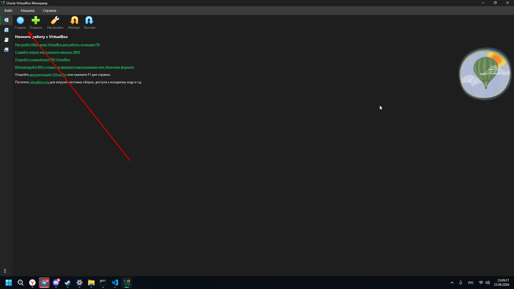
2. В выпавшем окне введите любое удобное названия для будущей виртуальной машины, а затем папку в которой она будет располагаться. Затем выберете ОС, которая будетзапускаться на ВМ и конкретную версию ОС чуть ниже (нас попросили установить Windows 10 64bit, но можно и 32bit'ную, если у вас не слишком мощный ПК)
    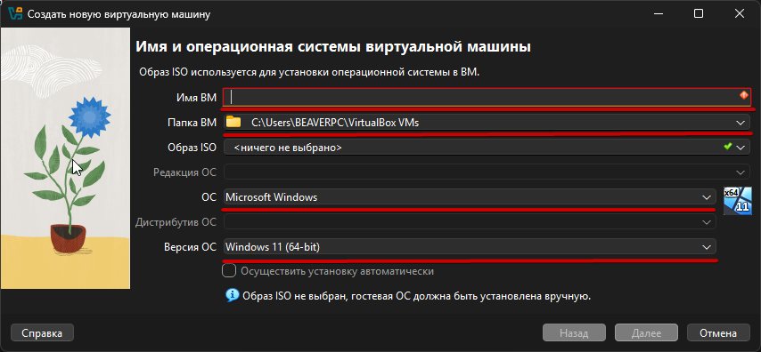
3. Теперь укажите виртуальное оборудование, как указано ниже. Размер диска при желании можно изменить, если вам не хватает места. После жмём `Далее` и `Готово`
    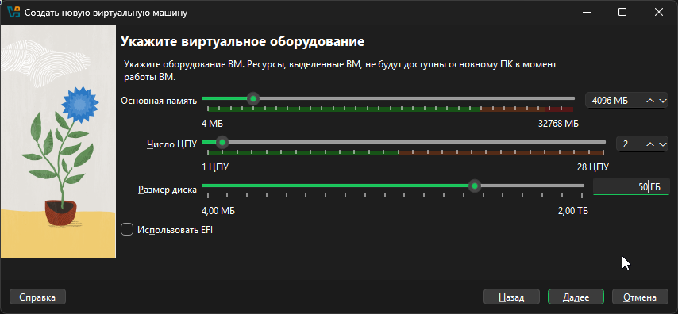
4. Продолжим настройку нашей ВМ! Наведите курсор на созданную вами только что машину и нажмите ПКМ. В выпашем окне `Настроить`, или просто нажмите `Crtl + S`
    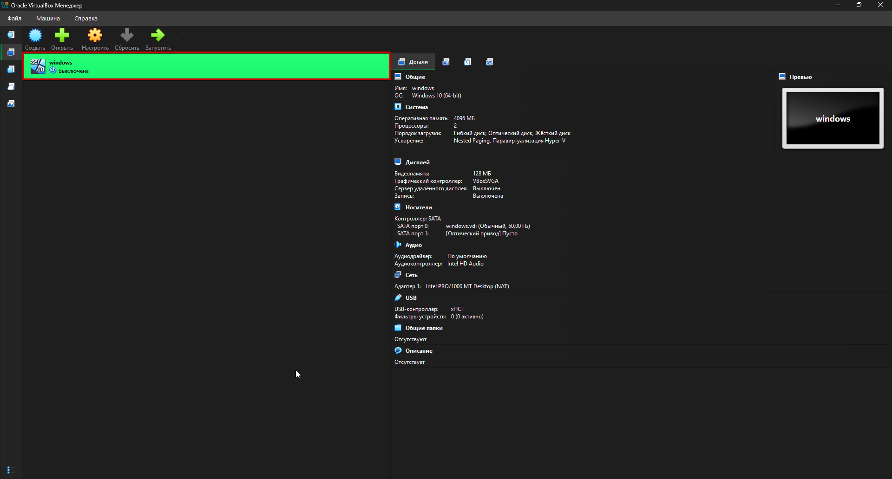
5. В выпавшем окне сначала выберете `Расширенные`, затем перейдите в раздел `Система` и там найдите `Порядок загрузки`. Внутри него первым поставьте *оптический диск*, на второе место *жёсткий диск*. Галочки напротив *сети* и *гибкого диска* убираем. Если вы устанавливаете Windows 11, а не 10, то поставьте галочку напротив пункта `UEFI` чуть ниже, но раз уж мы ставим 10, то нам это не пригодится
    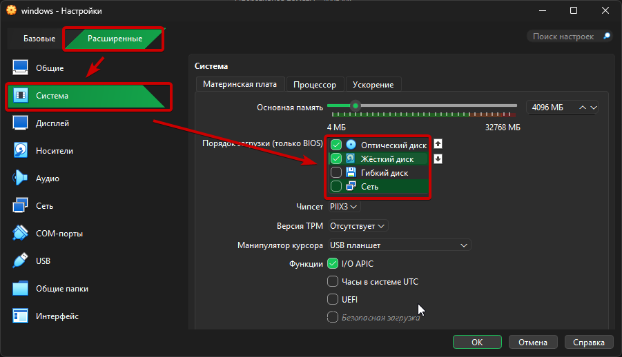
6. Далее переходим во вкладку `Процессор`, где проверяем стоит ли у нас 2 ядра, а также ставим галочку напротив пункта `PAE/NX`
    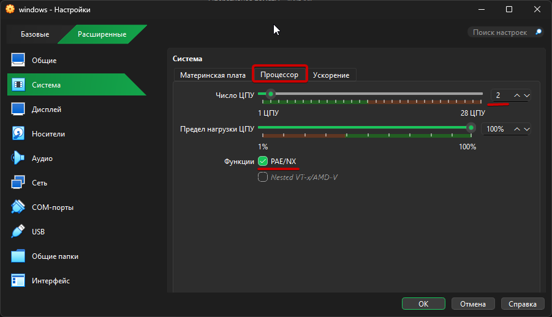
7. Переходим в раздел `Носители`. Там, если уже что-то есть, удаляем, нажам ПКМ, а потом `Del`
    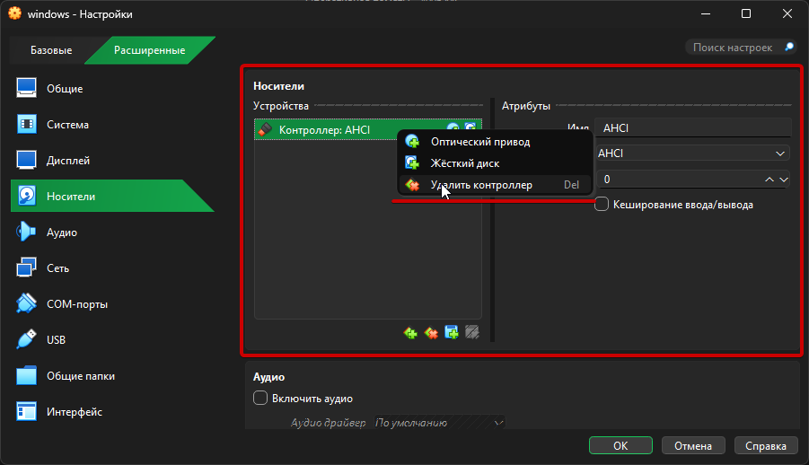
8. Чуть ниже ищем пункт `Добавить контроллер` и добавляем AHCI(SATA)
    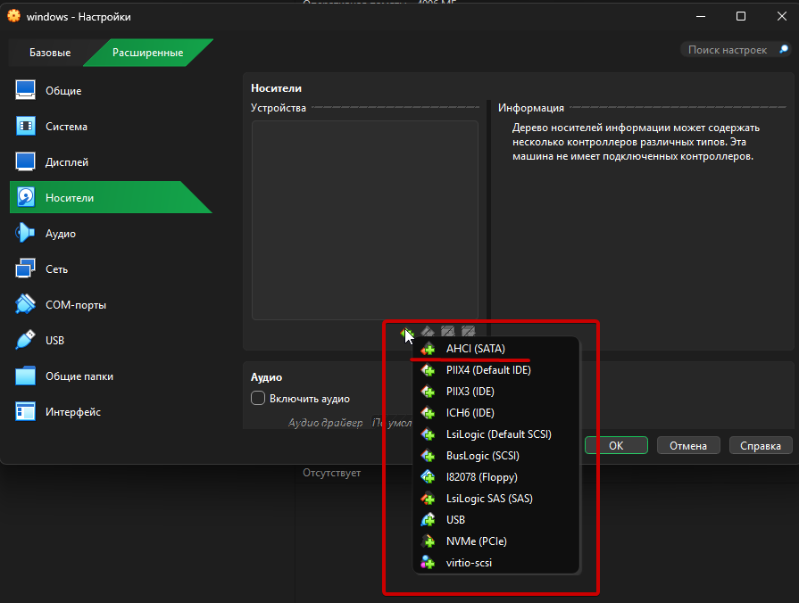
9. Теперь добавляем оптический диск
    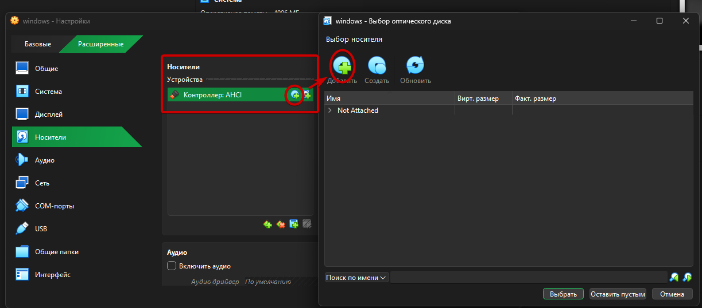
Найдите в выпавшем окне проводника ищем скачанный нами .iso образ, а после `Выбрать`
    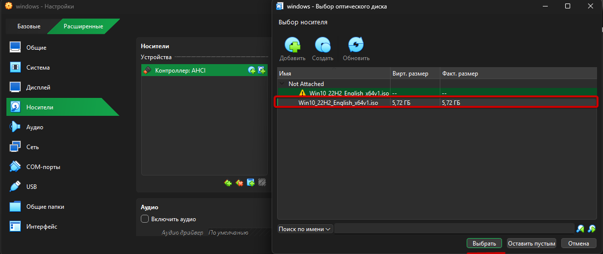
1.  Далее создаём жёсткий диск, выбираем пункт, что появился справа, а после `Выбрать`
    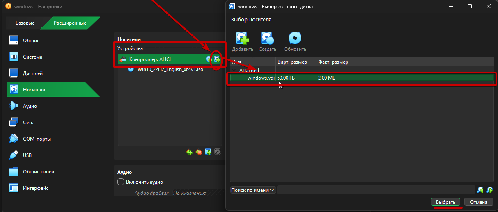
2.  Включаем `Кэширование`
    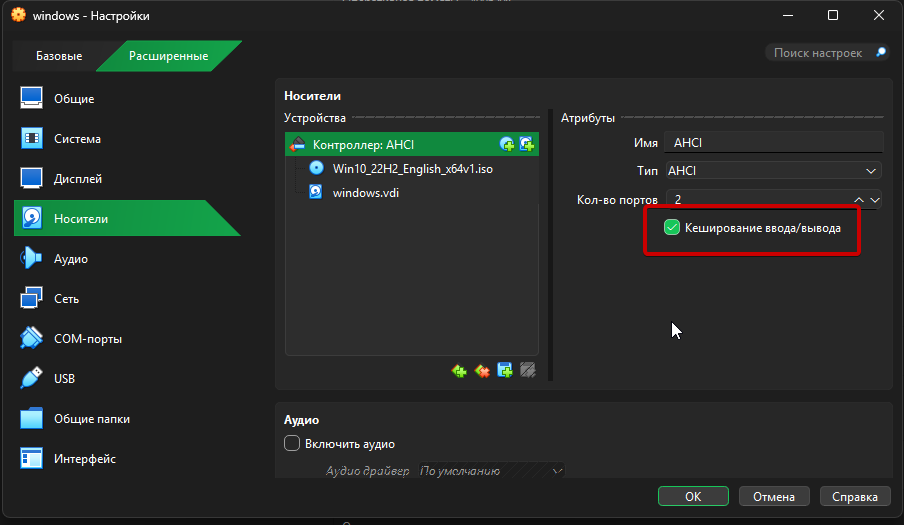
3.  Переходим в раздел `Аудио` и выключаем
    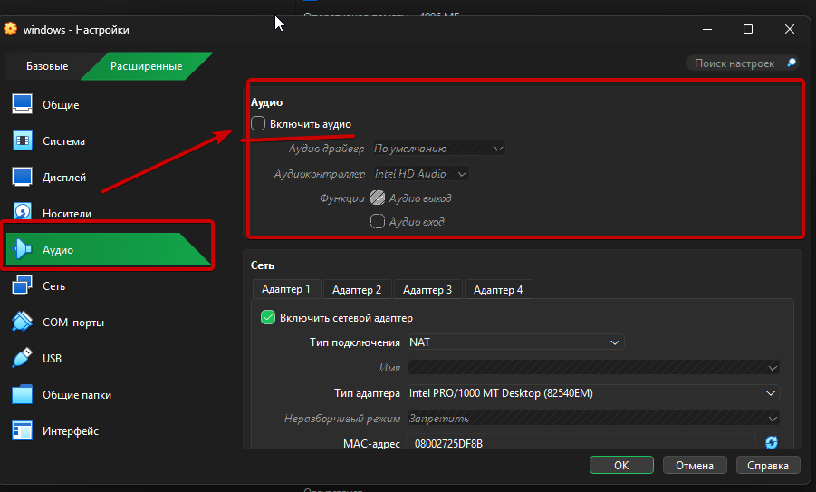
4.  Жмём `ОК` в нижней части экрана. Готово!